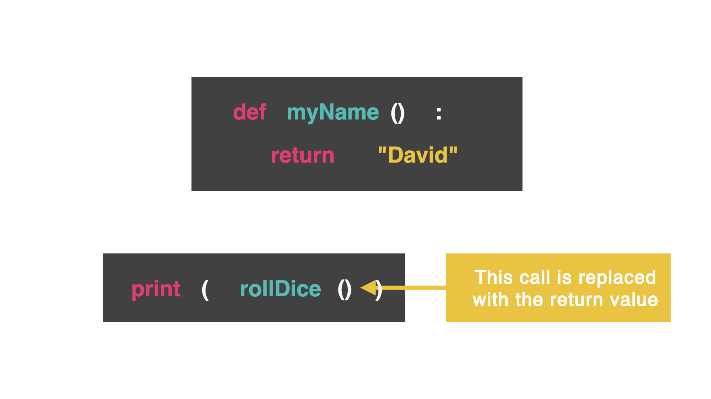

# Return Command

Let's go deeper into subroutines. Can they send information back to the main part of the program? 

Let's do this with the `return` command.



The `return` command sends some information back to the part of the code that called it. This means the function call is replaced with whatever was returned.

We saw this before with importing libraries and random numbers. We could use the random number wherever we wanted.

## Pin Picker

This subroutine creates a random pin number for us. This subroutine (called `pinPicker`) has the parameter called `number` (how many numbers I want to have in this pin). Then, there is a string (called `pin`) that is empty and a `for` loop that is used to create a defined amount of random numbers. The variable `number` controls how many times the loop will add the new number to the pin. This is done through `+=` and concatenating new values. We will cast the random number as a string so it can be concatenated together. 

Then...the magic...we `return` the pin.

👉 Let's see what happens:

```python
#subroutine has parameter called `number`
#`number` shows how many numbers we want the pin to have
def pinPicker(number):
  import random
  pin = "" #this is the empty string
  for i in range(number): #for loop shows defined amount of random numbers
    pin += str(random.randint(0,9)) #we want a string of random numbers between 0-9
  return pin
    
pinPicker(4) #4 means we want 4 random numbers
```

## Nothing happens? Why?

The line `pinPicker(4)` that calls for a 4 digit pin is being replaced by a 4 digit pin. (That's great, but I don't see that happening...)

We are not telling the computer to do anything with the string that was created. How do we make the string appear?

With `print` of course!

👉 Let's assign a variable to `pinPicker`:

```python
myPin = pinPicker(4)

```

👉 Now `print` it out:

```python
print(myPin)
```
### 👉 That was quite a doozy. Take time to pause and really try this code out.